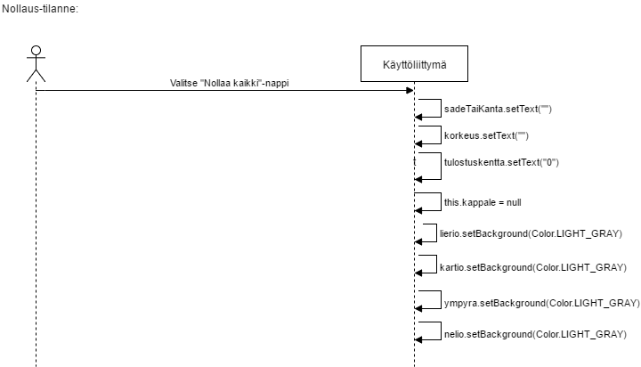

**Aihe:** Projektini aiheena on laskin, joka laskee suoran ympyrälieriön ja ympyräkartion sekä neliöpohjaisen lieriön ja kartion(eli pyramidin) pinta-alan ja tilavuuden. Käyttäjä valitsee aluksi haluaako laskea lieriön vai kartion pinta-alan ja tilavuuden. Sen jälkeen käyttäjä valitsee pohjan muodon(ympyrä/neliö) ja syöttää halutun kappaleen säteen/kannan pituuden sekä korkeuden. Lopuksi napin painalluksesta laskin tulostaa halutun kappaleen pinta-alan ja tilavuuden. 

**Käyttäjät:** Kaikki 

**Käyttäjien toiminnot:**
- Kappaleen valitseminen(lieriö/kartio)
- Kappaleen pohjan muodon valitseminen(ympyrä/neliö)
- Säteen/kannan ja korkeuden syöttäminen

----

### Luokkakaavio

### Rakennekuvaus

Projektissani on luotu aluksi jokaiselle mahdolliselle kappalleelle(YmpyralierioLogiikka, YmpyrakartioLogiikka, NelioPohjainenLierioLogiikka ja PyramidiLogiikka) oma luokkansa, jossa hoidetaan pinta-alan ja tilavuuden laskeminen. Sitten on luotu luokka LaskinLogiikka, joka yhdistää kaikki nämä neljä luokkaa yhden kokonaisuuden alle. LaskinLogiikka siis huolehtii laskimen loogisesta puolesta, eli laskee ja palauttaa juuri halutun kappaleen pinta-alan ja tilavuuden, käyttäen apunaan aiemmin luotuja luokkia.

Käyttöliittymä-luokka luo halutun alustan laskimelle, hoitaen vain ainoastaan käyttöliittymä-osuuden, sillä laskimeen liittyvä logiikka hoidetaan muissa luokissa. Klikkausten kuuntelija luokka yhdistää Käyttöliittymän ja laskimen loogisen osuuden yhteen, pitäen ne kuitenkin eroteltuna toisistaan.

----

### Sekvenssikaavio 1

### Sekvenssikaavio 2

### Sekvenssikaavio 3

### Sekvenssikaavio 4

