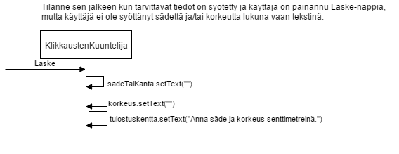

**Aihe:** Projektini aiheena on laskin, joka laskee suoran ympyrälieriön ja ympyräkartion sekä neliöpohjaisen lieriön ja kartion(eli pyramidin) pinta-alan ja tilavuuden. Käyttäjä valitsee aluksi haluaako laskea lieriön vai kartion pinta-alan ja tilavuuden. Sen jälkeen käyttäjä valitsee pohjan muodon(ympyrä/neliö) ja syöttää halutun kappaleen säteen/kannan pituuden sekä korkeuden. Lopuksi napin painalluksesta laskin tulostaa halutun kappaleen pinta-alan ja tilavuuden. 

**Käyttäjät:** Kaikki 

**Käyttäjien toiminnot:**
- Kappaleen valitseminen(lieriö/kartio)
- Kappaleen pohjan muodon valitseminen(ympyrä/neliö)
- Säteen/kannan ja korkeuden syöttäminen

### Luokkakaavio

